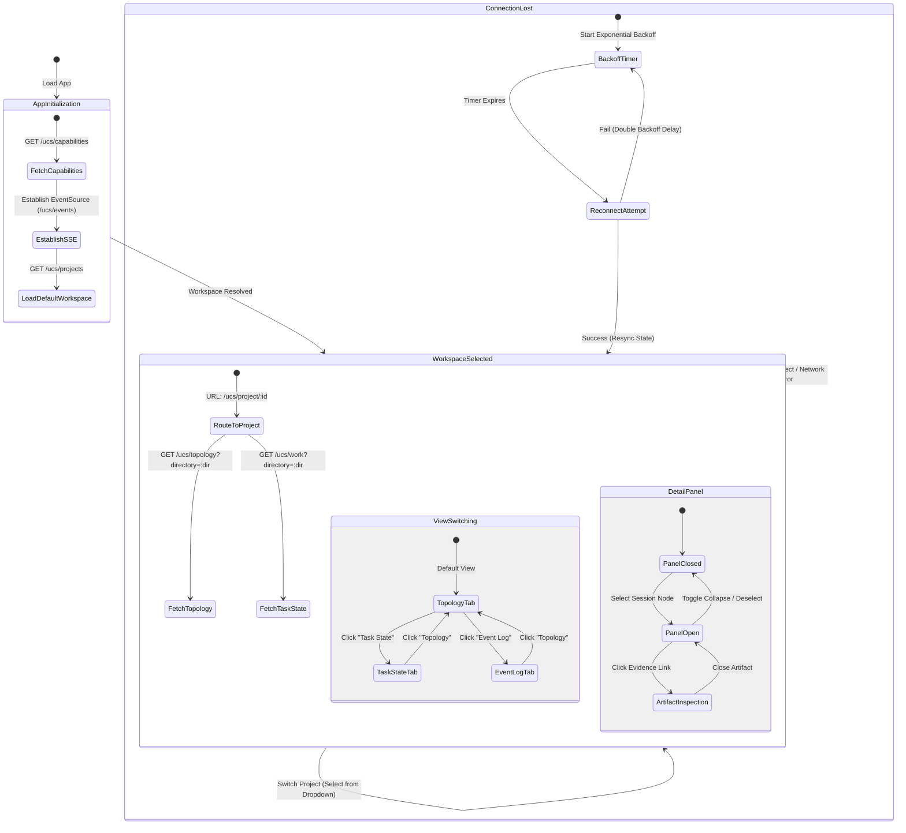
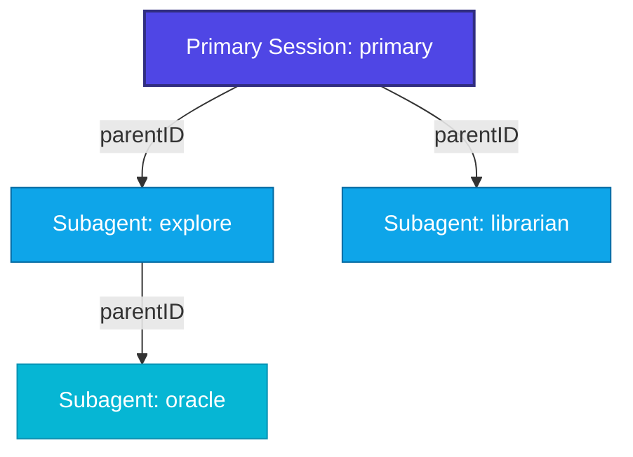
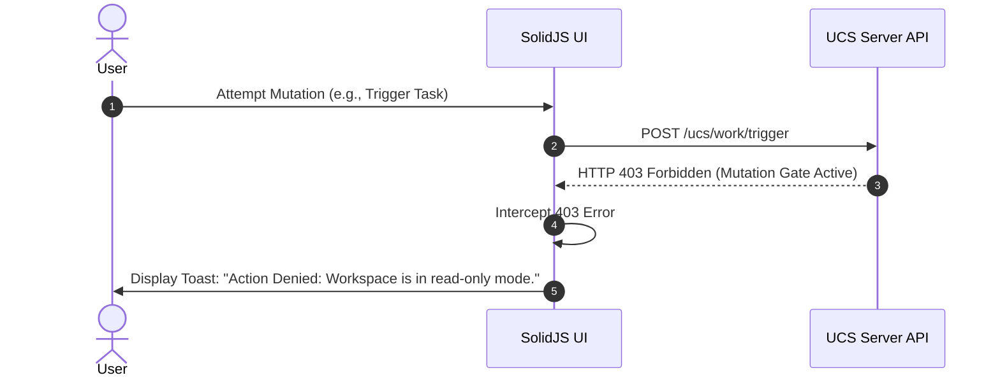
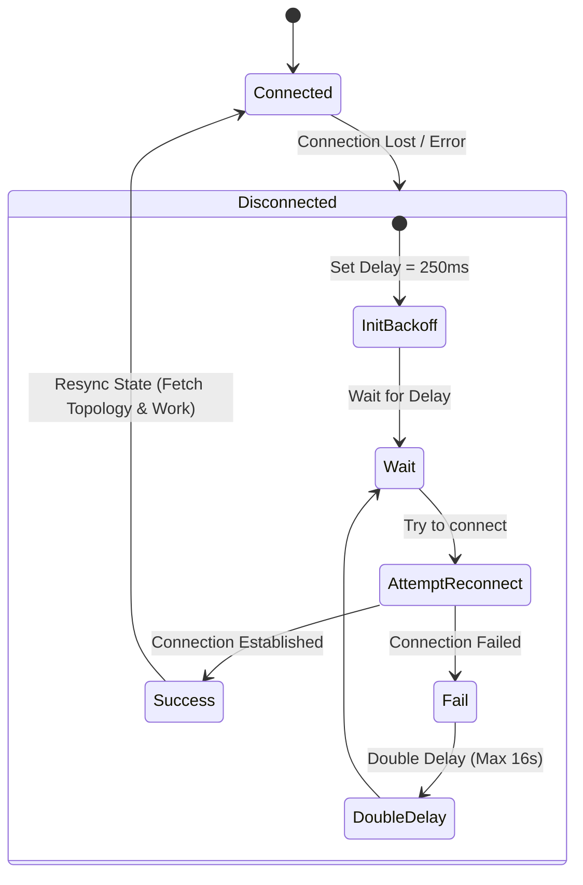
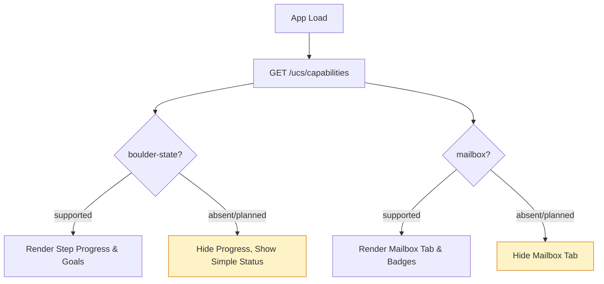

# UCS Frontend Strategy — Gate G2 UI Flow Diagram

- **Document Version:** 1.0.0
- **Date:** 2026-08-11
- **Status:** DRAFT FOR REVIEW
- **Target Recipient:** uc-studio

---

## 1. Executive Summary & Navigation Principles

The User Control System (UCS) Web vertical slice is designed as a high-fidelity, real-time monitoring interface for running agent sessions, project topologies, and task states. The frontend architecture is built on two core principles:

1. **Read-Only Posture:** Phase 2 of the UCS Web slice enforces a strict read-only posture. The UI is optimized for observation, visualization, and inspection. No state-mutating actions (such as starting sessions, modifying files, or triggering tasks) are exposed directly, and any unauthorized mutation attempts are intercepted at the boundary.
2. **Out-of-Band REST/SSE Navigation Model:** Navigation and state synchronization are decoupled:
   - **RESTful Routing:** Standard page transitions, workspace selections, and drill-downs update the browser URL (e.g., `/ucs/project/:id`). This triggers discrete, on-demand REST queries to fetch the initial topology, project list, and task state.
   - **Server-Sent Events (SSE) Synchronization:** Real-time updates (such as token accumulation, step transitions, and new subagent spawns) flow through a persistent SSE connection (`/ucs/events`). The UI reactively updates its local stores without full-page reloads or polling.

---

## 2. Overall Navigation Architecture

The UCS Web interface is structured as a multi-pane layout consisting of a **Workspace Sidebar**, a **Primary View Area** (with tabs for Topology, Task State, and Event Log), and a collapsible **Session Detail Drawer**.

### 2.1 View Layout Grid

```
+-----------------------------------------------------------------------------+
|  Header: Server Status & Capabilities | Workspace Selector (Project Dropdown) |
+-----------------------------------------------------------------------------+
| Sidebar:          | Primary View Area (Tabs)                                |
|                   | [ Topology Tree ] [ Task State ] [ Event Log ]          |
| - Project List    | +-----------------------------------------------------+ |
| - Active Sessions | |                                                     | |
| - Quick Filters   | |                                                     | |
|                   | |                                                     | |
|                   | |                                                     | |
|                   | +-----------------------------------------------------+ |
+-------------------+---------------------------------------------------------+
| Footer: SSE Connection Status (Connected/Reconnecting) | Active Session Count|
+-----------------------------------------------------------------------------+
```

### 2.2 Mermaid State Transition Diagram



---

## 3. Workspace Switch Flow

Selecting a project triggers a cascade of routing, state re-scoping, and event subscription updates.

```mermaid
sequenceDiagram
    autonumber
    actor User
    participant UI as SolidJS UI
    participant Router as Router (/ucs/project/:id)
    participant SDK as Server SDK Context
    participant Server as UCS Server API

    User->>UI: Select Project from Dropdown
    UI->>Router: Navigate to /ucs/project/:id
    Router->>SDK: Trigger Directory Re-scope (directory = project.worktree)
    SDK->>Server: GET /ucs/topology?directory=:dir
    Server-->>SDK: Return UcsTopology (entries, activeSessionCount)
    SDK->>Server: GET /ucs/work?directory=:dir
    Server-->>SDK: Return UcsTaskState (boulder, integrations, evidenceCount)
    SDK->>UI: Update Local Stores (Topology, Task State)
    Note over SDK, Server: SSE Event Stream remains open; events are filtered client-side by directory
```

### Flow Details:
1. **Selection:** The user clicks a project in the Workspace Selector.
2. **Route Update:** The router updates the URL path to `/ucs/project/:id` (where `:id` is the base64-encoded or hashed project directory path).
3. **Topology Re-scope:** The `ServerSDK` context detects the directory change and re-scopes the active directory context.
4. **REST Fetch:** The UI concurrently dispatches requests to `/ucs/topology` and `/ucs/work` using the new directory query parameter.
5. **SSE Filtering:** The global SSE stream (`/ucs/events`) continues running. Incoming events are filtered reactively by matching the `directory` property in the event envelope to the currently active project directory.

---

## 4. Topology Tree & Subagent Drill-Down Flow

The **Topology Tab** renders a hierarchical tree representing the primary session and its spawned subagents.



### 4.1 Traversal and Detail Panel Interaction

1. **Tree Rendering:** The tree is built dynamically from the `entries` array in `UcsTopology`. Nodes are linked using the `parentID` field.
2. **Node Selection:** Clicking any node (Primary or Subagent) updates the active session selection state.
3. **Detail Panel Activation:** Selecting a node slides open the right-hand **Session Detail Panel**, displaying:
   - **Metadata:** Agent name, model, execution time, and token usage (input, output, cache read, cache write).
   - **Status & Step:** Current status (e.g., `in_progress`, `completed`) and the active step description.
   - **Evidence Count:** Number of artifacts recorded for this session.
4. **Artifact Inspection:** Clicking the evidence count or an artifact link opens the **Artifact Viewer Overlay**, displaying the specific files, tool calls, or logs associated with the session.

---

## 5. SSE Event Log Filter & Search Flow

The **Event Log Tab** provides a real-time observer for all events flowing through the SSE stream.

```
+-----------------------------------------------------------------------------+
| Event Log Observer                                                          |
+-----------------------------------------------------------------------------+
| Filter by Session: [ All Sessions | v ]  Filter by Type: [ All Types | v ]  |
| Search Logs:       [ Enter regex...   ]  [X] Live Tailing  [ ] Freeze Scroll|
+-----------------------------------------------------------------------------+
| [10:30:01] [INFO]  [session.text.delta] Session ses_abc: "Analyzing files..."|
| [10:30:05] [WARN]  [lsp.updated] LSP diagnostics updated for index.ts       |
| [10:30:12] [ERROR] [permission.asked] Permission requested for bash execution|
| [10:30:15] [INFO]  [session.tool.input.delta] Tool call: read file          |
+-----------------------------------------------------------------------------+
```

### 5.1 Filtering and Auto-Scroll Mechanics

- **Topic & Session Filters:** Users can filter the log stream by specific `sessionID` or event `type` (e.g., `session.text.delta`, `permission.asked`).
- **Regex Search:** A text input allows real-time filtering of event payloads using regular expressions.
- **Auto-Scroll Freeze:**
  - By default, the log observer auto-scrolls to the bottom as new events arrive (**Live Tailing** active).
  - If the user manually scrolls up to inspect past events, the UI automatically toggles **Freeze Scroll** to `true` and pauses auto-scroll.
  - A floating badge ("New events available - Scroll to bottom") appears. Clicking it resets the scroll position to the bottom and reactivates Live Tailing.

---

## 6. Side Panel Toggle & Layout States

The interface utilizes a responsive, multi-pane grid that adapts to different screen sizes and capability states.

### 6.1 Responsive Layout States

- **Desktop (> 1024px):** Three-column layout (Workspace Sidebar, Primary View, Session Detail Panel). Side panels can be collapsed/expanded via keyboard shortcuts (`Cmd+B` for Sidebar, `Cmd+J` for Detail Panel) or toggle buttons.
- **Tablet (768px - 1024px):** The Session Detail Panel collapses into a slide-over drawer. The Workspace Sidebar remains visible but can be collapsed to maximize the Primary View.
- **Mobile (< 768px):** Both the Workspace Sidebar and Session Detail Panel behave as full-screen drawer overlays. The Primary View occupies 100% of the viewport.

### 6.2 Capability Fallback States

The UI dynamically adapts based on the `UcsCapabilityManifest` returned by `/ucs/capabilities`:

| Capability | Status = `supported` / `beta` | Status = `planned` / `absent` |
|---|---|---|
| `boulder-state` | Render step progress bar, task goals, and step list in the Task State tab. | Hide step progress; display a simplified status banner. |
| `mailbox` | Render the Mailbox tab and notification badges. | Hide the Mailbox tab and disable notification polling. |
| `evidence` | Render the Artifact Viewer and evidence links in the Detail Panel. | Hide evidence links and display "Evidence tracking unavailable". |

---

## 7. Error, Reconnect & Security Gate Flows

### 7.1 403 Mutation Gate Error Flow

Because the Phase 2 vertical slice is strictly read-only, any attempt to perform a mutation (e.g., via a hidden or legacy UI element, or direct console manipulation) is blocked.



### 7.2 SSE Disconnect & Exponential Backoff Reconnect Flow

When the SSE connection is lost, the client initiates a reconnect loop with exponential backoff to prevent server overload.



#### Resync Protocol:
Upon successful reconnection, the client must perform a full state resync:
1. Re-fetch `/ucs/topology` to capture any subagents spawned during the disconnect.
2. Re-fetch `/ucs/work` to update the latest task and integration states.
3. Flush any queued local UI updates.

### 7.3 Capability Degradation Fallback Flow

If a capability is marked as `planned` or `absent`, the UI degrades gracefully without throwing runtime errors.


